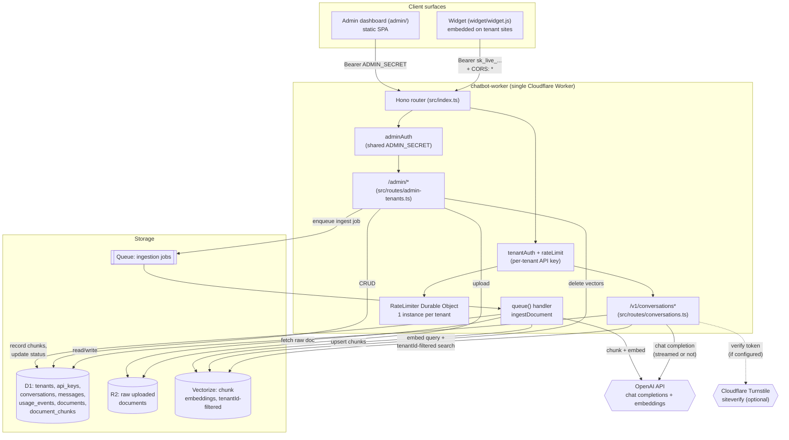

# Architecture

One Cloudflare Worker (`src/index.ts`, Hono router) fronting everything;
D1 as the system of record; R2/Vectorize/Queues for the RAG pipeline;
OpenAI for generation and embeddings. No separate backend service — the
Worker *is* the backend.

## Request paths

**Chat message** (`POST /v1/conversations/:id/messages[/stream]`):
`tenantAuth` resolves the tenant from the hashed API key → `rateLimit`
checks the per-tenant Durable Object → `isOverMonthlyBudget` checks
`usage_events` → if the tenant has ingested documents,
`getGroundedContext` embeds the query and does a `tenantId`-filtered
Vectorize search, wrapping the system prompt with grounding/citation/
injection-defense instructions → `chatCompletion`/`streamChatCompletion`
calls OpenAI → `persistTurn` writes both messages plus a costed
`usage_events` row to D1 in one batch.

**Document ingestion** (`POST /admin/tenants/:id/documents` → async):
the HTTP request only writes to R2, inserts a `documents` row, and
enqueues a job — it returns immediately. The `queue()` handler in
`src/index.ts` does the actual work: fetch from R2 → `chunkText` → embed
each chunk via OpenAI → upsert into Vectorize → write `document_chunks`
rows → flip `documents.status` to `ready` (or `failed`, with a reason).

## Why one Worker, not several

Everything (chat, RAG retrieval, admin CRUD, ingestion) runs in this one
Worker rather than being split into separate services. At this scale
that's simpler to reason about, deploy, and test — the tradeoff noted in
[THREAT_MODEL.md](./THREAT_MODEL.md)'s Secrets Store section is exactly
this: splitting ingestion into its own Worker would be the trigger to
revisit that decision, not before.

## What's *not* in this diagram

Cloudflare Access (gating the admin dashboard) and a real Vectorize index
per environment both need actions against a live Cloudflare account that
this build environment doesn't have — see README "RAG pipeline" and
"Admin dashboard" for the exact commands to provision them for real.
